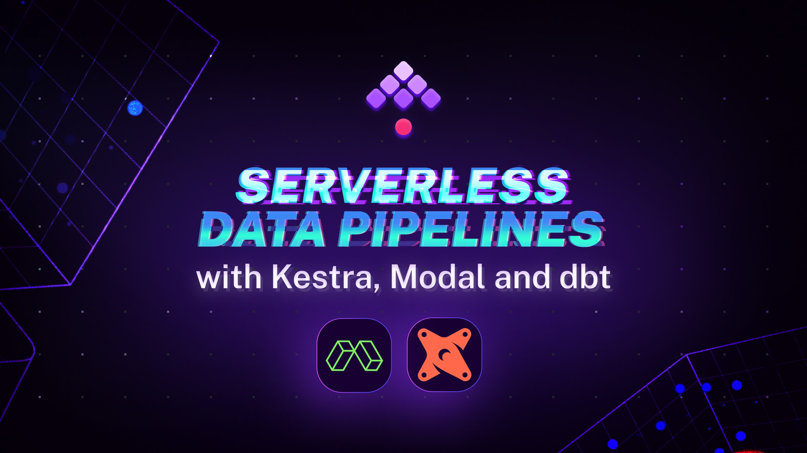

# Serverless Data Pipelines with Kestra, Modal and dbt

[](https://www.youtube.com/watch?v=Wqz7CZudqNo)

This project integrates [Kestra](https://kestra.io/) with [dbt](https://www.getdbt.com/) and [Modal](https://modal.com/) to showcase a serverless data transformation project. 

The project is inspired by the [jaffle-shop-template](https://github.com/dbt-labs/jaffle-shop-template). However, we've made some adjustments to:
1. Make things even easier to reproduce  — you'll use exactly the same source data hosted with [HuggingFace Datasets](https://huggingface.co/datasets/kestra/datasets/tree/main/jaffle-parquet) rather than generating them randomly. 
2. Make it work with any supported dbt-adapter, not only with DuckDB.
3. Keeep things simple - we'll use a lightweight setup without complex data ingestion or BI tools

## Getting Started

### Prerequisites

- Python
- SQL
- dbt
- Kestra

### Setup

1) Start Kestra:

```sh
docker run --pull=always --rm -it -p 8080:8080 --user=root \
-v /var/run/docker.sock:/var/run/docker.sock -v /tmp:/tmp kestra/kestra:latest server local
```

Or follow a more detailed guide in the [Installation documentation](https://kestra.io/docs/getting-started/installation).

2) Configure your `profiles.yml` for BigQuery:

```yaml
bigquery:
  outputs:
    prod:
      type: bigquery
      dataset: "{{ env_var('DBT_SCHEMA', 'dwh') }}"
      project: "{{ env_var('DBT_DATABASE', 'geller') }}"
      keyfile: "{{ env_var('GOOGLE_APPLICATION_CREDENTIALS', 'sa.json') }}"
      location: EU
      method: service-account
      priority: interactive
      threads: 16
      timeout_seconds: 300
      fixed_retries: 1
  target: prod
```

Make sure you add your BigQuery credentials to the `sa.json` file and keep that file in `.gitignore`.

### Credentials setup

To securely manage sensitive data such as Modal tokens or GCP credentials in Kestra, you can use [Secrets](https://kestra.io/docs/concepts/secret). Adding secrets requires some additional setup, so to keep things simple for development, you can store them in the [KV Store](https://kestra.io/docs/concepts/kv-store). Replace the placeholders with your actual credentials and execute the flow shown below. Alternatively, you can also add your KV pairs directly from the UI by navigating to the namespace `company.team` and adding the key-value pairs from the `KV Store` tab.

```yaml
id: setup
namespace: company.team

tasks:
  - id: gcp
    type: io.kestra.plugin.core.kv.Set
    key: GCP_CREDS
    kvType: JSON
    value: |
      {
        "type": "service_account",
        "project_id": "...",
      }

  - id: github
    type: io.kestra.plugin.core.kv.Set
    key: GITHUB_ACCESS_TOKEN
    kvType: STRING
    value: xxx

  - id: modal_token_id
    type: io.kestra.plugin.core.kv.Set
    key: MODAL_TOKEN_ID
    kvType: STRING
    value: xxx

  - id: modal_token_secret
    type: io.kestra.plugin.core.kv.Set
    key: MODAL_TOKEN_SECRET
    kvType: STRING
    value: xxx
```

### Running the flow

Use the flow stored in the `_flows` folder. Deploy it via [CI/CD ](https://kestra.io/docs/getting-started/version-control-cicd) or add it directly from the UI.

### Working with Larger Datasets

To test the project on a larger dataset (e.g. to test your infrastructure scalability and the performance of your dbt models), swap the first URL (jaffle-parquet) for the latter (jaffle-large) in the `dataset_url` input.

## Contributing

Contributions are welcome! Please open an issue or submit a pull request.
